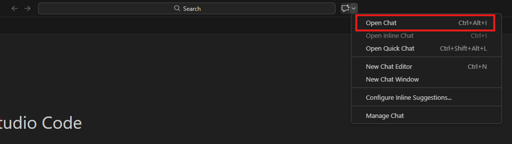
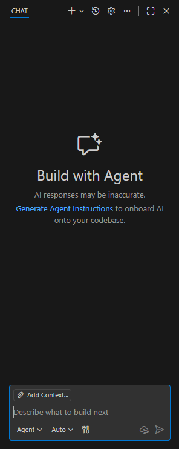
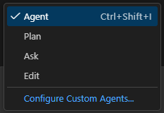

# Vibe coding

Vibe coding är att med hjälp av AI skapa generativ kod via prompter eller få förslag och autokomplettera kod under tiden den skrivs. Vi kommer gå igenom hur man kommer igång med vibe coding och exempel på kod man kan skapa med hjälp av detta.

## Inline

Vibe coding kallas för **Inline** när AI som hjälpmedel används direkt när man skriver kod.

I visual studio code kan man få automatiska förslag för kod. Ett exempel kan vara om man skriver: ```<!DOCTYPE html>``` kan man få förslaget:


Där man kan trycka ```Tab``` för att godkänna eller välja förslaget.

## Agenter

Att skriva 

För att öppna AI chatten klickar man på dropdown-menyn högst upp i visual studio code och sedan på `Open Chat` eller kortkommandot `Ctrl+Alt+I`.








